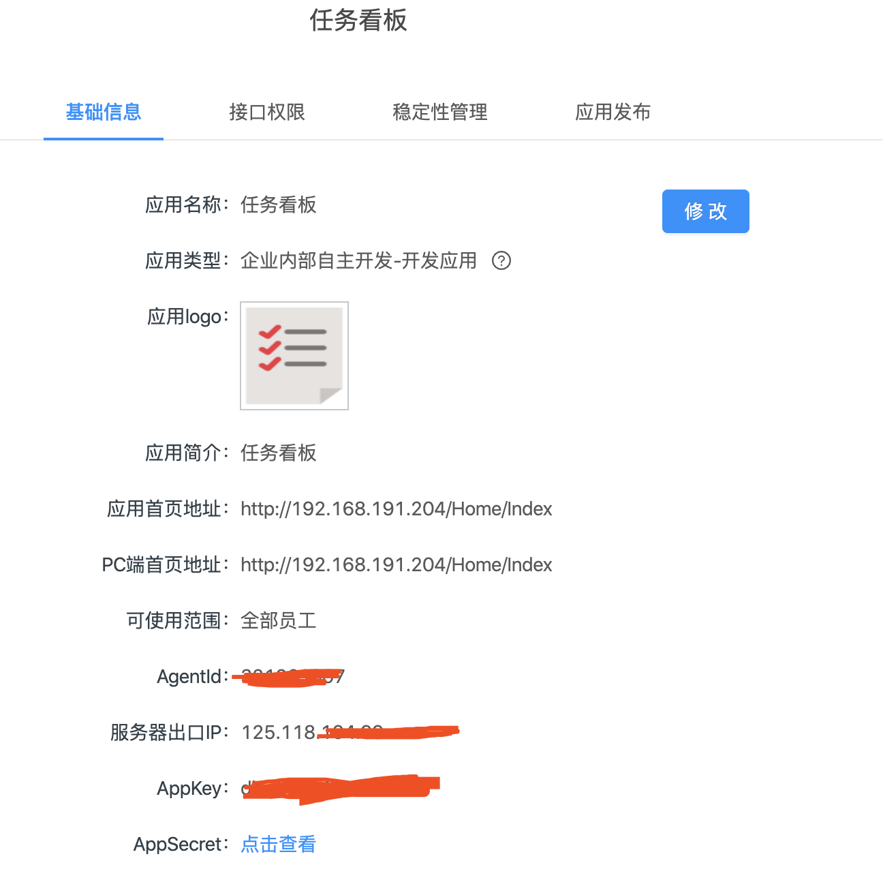
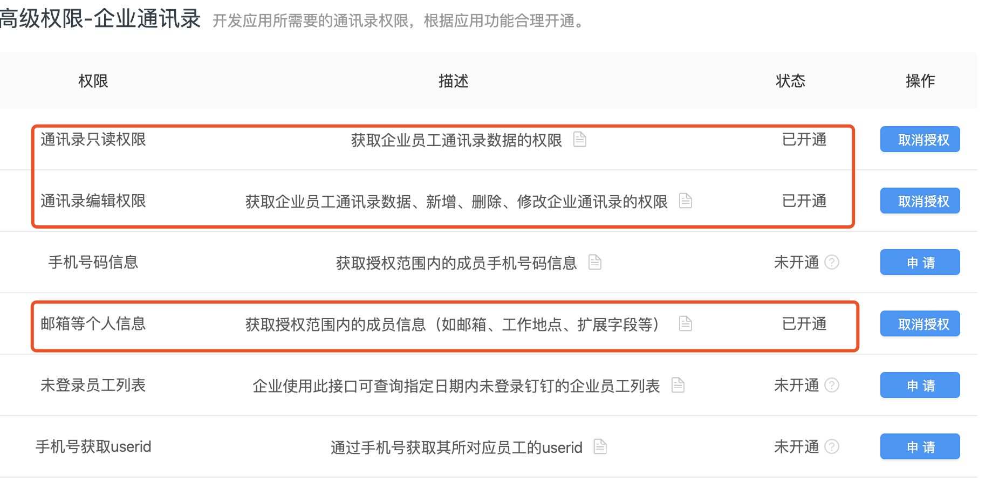

# dingtalkwekan

## 概要
公司使用钉钉作为办公通讯工具，该项目可以实现在钉钉工作台中登录wekan；

> [wekan](https://github.com/wekan/wekan)是一款功能强大的的开源看板工具;

## 步骤：

1. 在钉钉管理后台添加「H5微应用」新建应用「任务看板」

2. 申请钉钉接口权限

3. 修改nginx 配置，参考[nginx.conf](nginx/conf/nginx.conf)

4. 修改DingtalkWekan目录下的appsettings.json中的配置

5. 启动 wekan,启动 DingtalkWekan，启动nginx ；

6. 在钉钉工作台中进入「任务看板」即可直接登录 wekan